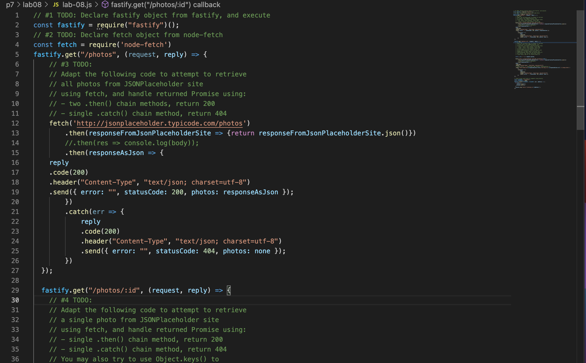

## Welcome to Lab8

This weeks lab we learned how to apply node-fetch with fasitfy and run it with our server.

Lab goals and outcomes:

Part 1: Create lab file and initialize Node.js folder

Part 2: Install node-fetch package

Part 3: Add fastify starter code

Part 4: Add fastify and node-fetch require statements

Part 5: Fetch JSONPlaceholder data

